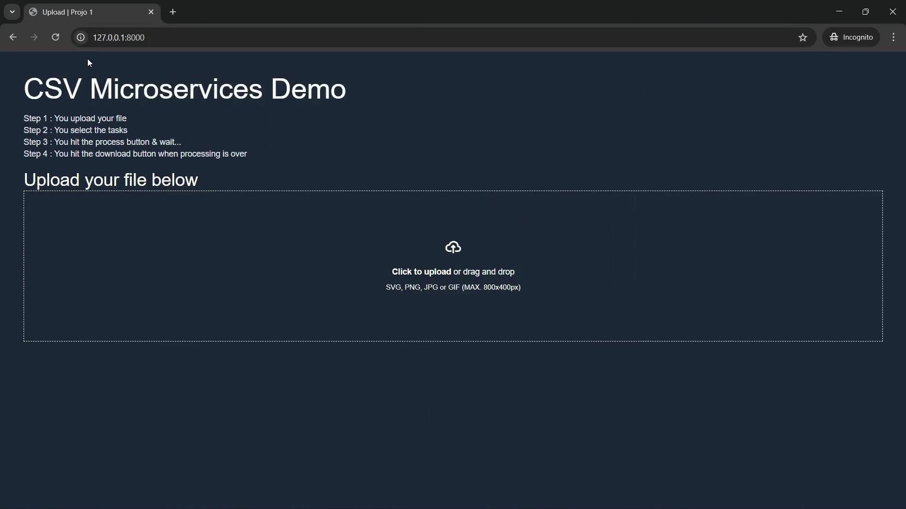
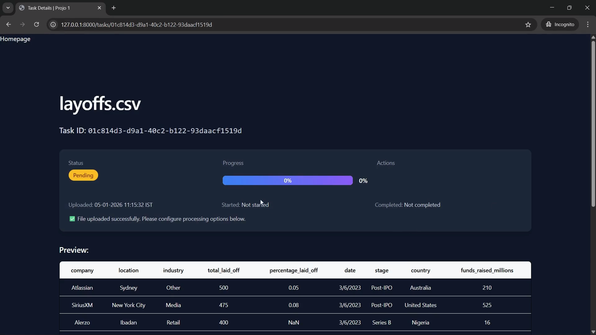
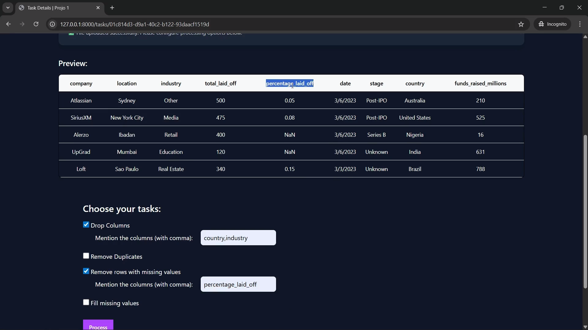
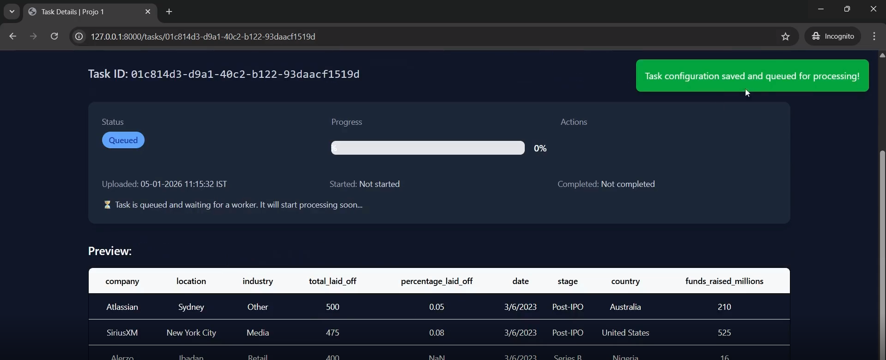
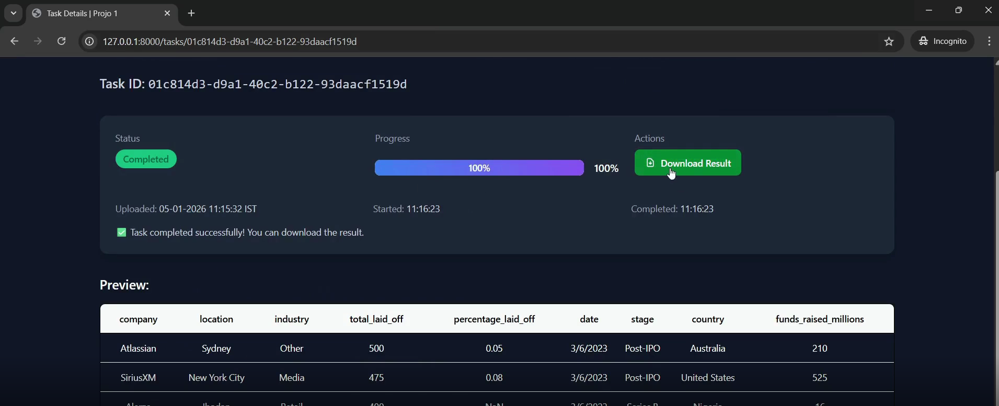
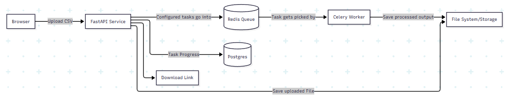
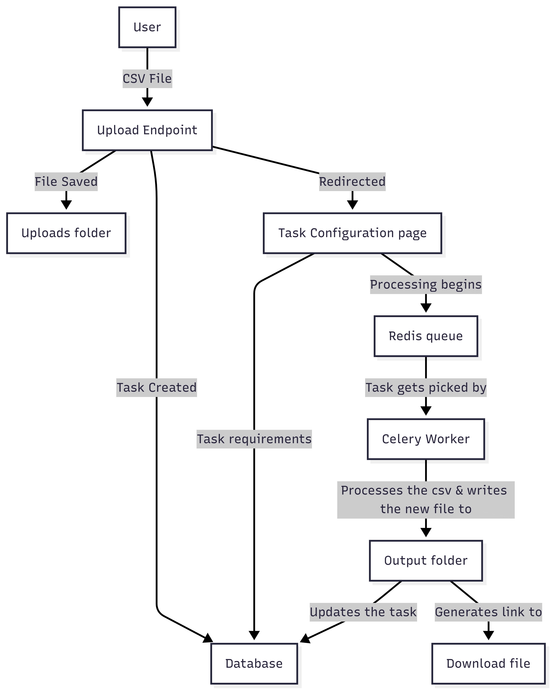

# Scalable CSV Data Processing System

A high-performance microservices application designed for asynchronous CSV file manipulation. Built to handle heavy data processing without blocking user interaction using FastAPI, Celery, and Redis.

## ✅ Key Features

- **Asynchronous Processing**: Files are queued in Redis and processed by dedicated Celery workers.
- **Configurable Pipelines**: User-defined operations including duplicate removal, column dropping, and missing value handling.
- **Containerized Architecture**: Fully orchestrated with Docker Compose for seamless "one-command" deployment.

## 📸 Screenshots & Demos

**Demo Video** (click the gif for full demo video)

[](./docs/full-demo.mp4)

**Home Page**


**Task Details Page**


**Task Configuration**


**Task Queued**


**Task Complete Download Button**


## 🛠 Tech Stack

| Component      | Technology     | Role                                               |
| -------------- | -------------- | -------------------------------------------------- |
| Backend        | FastAPI        | High-performance asynchronous REST API             |
| Database       | Postgres       | Stores the task metadata                           |
| Task Queue     | Celery + Redis | Asynchronous task management and message brokering |
| Data Handling  | Pandas         | Efficient CSV manipulation and transformation      |
| Infrastructure | Docker Compose | Service orchestration and environment isolation    |

## 🏗 System Architecture



## Data Flow Diagram



## 🚀 Getting Started

### Prerequisites

- Docker should be installed
- `.env` files of your own

Check the `.env.example` for more info.

### Step 1

Clone the repo and start the entire stack:

```bash
git clone https://github.com/abhik-b/csv-microservices.git

cd csv-microservices
```

### Step 2

Then in the terminal : `docker compose --build --no-cache`

This will get the project built

Then run `docker compose up` to get the project up and running.

## Acknowledgements

1. Thanks to this article on ([setting up pgadmin with docker](https://www.geeksforgeeks.org/postgresql/run-postgresql-on-docker-and-setting-up-pgadmin/))

---

### 📬 Contact me via <a href="https://linkedin.com/in/abhikb1234" target="blank"></a> for any queries
